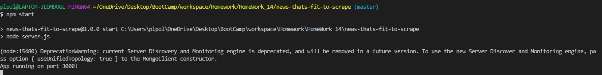

# News-That-Fits-To-Scrape

### Overview
Using express, mongoose, cheerio, and axios in the background, this application creates a user interface that scrapes https://www.nytimes.com/section/technology. The application pulls up to date information including headlines, summaries, links for the top latest articles nytimes/technology has to offer.

### How To Access: 

 # Locally 

 To download the application onto your own machine please use https://github.com/TomaszChylinski/news-thats-fit-to-scrape.git. 

  * Once cloned onto your machine, open the terminal of your choice to the following directory news-thats-fit-to-scrape.
  * Run npm install (installs all dependecies)
  * In your mongo terminal create news-that-fit database
  * Run npm start to start the application locally
  * Visit your localhost please keep attention to the port you are using

 
 
   

- Once on the user-survey page, users will have to input their name and a source to an image file, in addition they will be asked to answer nine questions that best relate to them.

   

- Once the user has completed the survey and successfully inputed values for the two questions asked they may proceed by clicking on the "Submit" button. 

- Clicking on the button will trigger the application to render a celebrity that best fits to the user answers. 

   
- In addition the application will also store the users input and survey answers for future use. (Users can access this data by clicking on the "API Friends List" link         that is found in the footer of the application).

- Below is screenshot of the updated data. 

   
